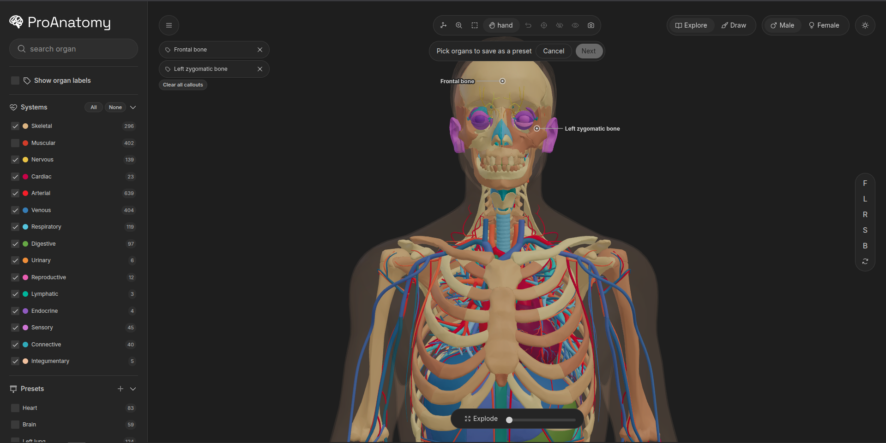

<picture>
  <source media="(prefers-color-scheme: dark)" srcset="./pro-anatomy/src/assets/images/logo.svg">
  <source media="(prefers-color-scheme: light)" srcset="./pro-anatomy/src/assets/images/logo-light.svg">
  
</picture>

**An interactive 3D anatomy viewer.** Spin the body, peel it apart layer by layer, isolate what you're studying, label it, and take notes. Everything saves to your account.

[**Open the app →**](https://pro-anatomy-red.vercel.app) &nbsp;·&nbsp; [**Watch the demo →**](https://youtu.be/AYiJcjjrpZM)

---

---

## Built for studying, not for showing off

Most 3D anatomy tools are either too simple to be useful or too complicated to open when you actually need them. This one is sized for the way anatomy gets studied: you have fifteen minutes, you want to see one thing clearly, you want to remember it next time.

### Peel the body apart layer by layer

Sixteen body systems, each one toggleable on its own. Turn off the skin and muscle to see the skeleton. Turn off everything except the heart. Drag the explode slider and the whole model comes apart in front of you. The camera stays where you put it — you never lose your place.

### Isolate exactly what you're looking at

Double-click any organ to isolate it. Ctrl+click to add more to the selection. Drag a rectangle across the screen to grab everything in it. Whatever you isolate, everything else steps aside, and one key press brings it all back.

### Label the things you keep forgetting

Pin a callout to any structure and it stays there. Rotate the body, isolate something else, turn a system off — the label follows. The names you pinned are always where you left them.

### Draw right on the model

Circle a structure. Draw an arrow to show blood flow. Write the name of the artery in the margin. Your marks stick to the surface as the model rotates, so when you come back to this exact view, the annotations are still in the right place.

### Take notes that remember the context

Attach a note to a single organ, an entire system, or nothing in particular. When you open the app next week, the note is still attached to the right thing. Notes and presets both follow your account — not the model, not the browser.

### Save the views you actually use

Group a set of structures — the four chambers of the heart, the bones of the hand — name them, and save them. One click brings back the exact view, exactly as you left it.

### Capture and share

Take a screenshot at 2× or 4× resolution. Labels, drawings, and callouts all come through. Copy to clipboard or download as a PNG. Useful for study slides, flashcards, or just sending to someone who asked what you were looking at.

---

## Two models

**Male** — full-body model from the BodyParts3D dataset. Roughly 2,000 individually selectable structures across all sixteen systems. Best for detailed regional anatomy.

**Female** — from the Human Reference Atlas. A single continuous mesh, useful for seeing how everything sits together.

Switch between them from the top of the viewer. Notes and presets are saved against structure IDs, so a preset you made for the male model degrades gracefully on the female one — parts that don't exist are marked rather than silently dropped.

---

## Keyboard shortcuts

Every action in the viewer has a keyboard shortcut. The tooltips show them when you hover, but here's the whole set.

| Action | Key |
|---|---|
| **Tools** | |
| Orbit | `O` |
| Zoom | `Z` |
| Select | `V` |
| Hand (pan) | `H` |
| **Camera** | |
| Front / Left / Right | `F` `L` `R` |
| Side / Back / Top | `S` `B` `T` |
| Bottom | `⇧B` |
| Auto-rotate | `Space` |
| Reset view | `⌘0` / `Ctrl+0` |
| **Selection** | |
| Isolate | `Enter` |
| Hide | `Del` |
| Restore everything hidden | `⇧H` |
| Clear selection | `Esc` |
| Undo last step | `⌘Z` / `Ctrl+Z` |
| **Labels and annotations** | |
| Toggle callout | `C` |
| Add note | `N` |
| Save selection as preset | `P` |
| Explode view | `E` |
| Toggle labels | `⇧L` |
| **Search and capture** | |
| Search organs | `⌘K` / `Ctrl+K` |
| Screenshot | `⌘S` / `Ctrl+S` |
| **Drawing** | |
| Brush / Eraser | `B` `E` |
| Line / Arrow | `L` `A` |
| Rectangle / Ellipse | `R` `C` |
| Text | `T` |
| Edit existing drawings | `X` |

---

## Who it's for

Medical and nursing students who want a clean reference without opening a textbook. Anyone studying for an anatomy exam who needs to look at one structure and come back to it later. Teachers who want to screenshot a view for slides.

It's free, there's no paywall, and it doesn't track you.

---

## Notes on the models

The models come from openly licensed anatomical datasets. Male from [BodyParts3D](https://lifesciencedb.jp/bp3d/) (CC BY-SA 2.1 JP), female from the [HRA](https://humanatlas.io/) (CC BY 4.0). Their original licenses still apply.

---

## License

Source is MIT. The anatomical models keep their original licenses — see above.

---

## Feedback

If you're studying anatomy and something is missing, named wrong, or grouped badly — open an issue or send me a message. That's the whole reason this exists, and the small stuff matters more than you'd think.
